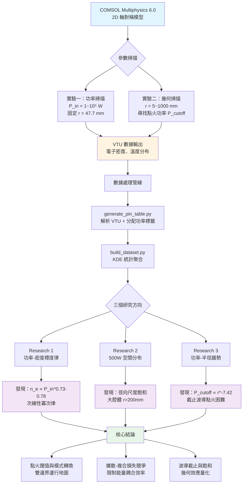

# COMSOL 2.45GHz 微波電漿模擬研究

國立新竹科學園區實驗高級中等學校 第十五屆科學班個別科學研究

研究者：陳亮宇
指導教授：張存續 教授（國立清華大學）

## 研究內容

使用 COMSOL Multiphysics 建立二維軸對稱模型，探討 2.45 GHz 微波電漿的：

1. 功率-密度標度律（n_e ∝ P_in^0.73-0.78）
2. 體積波到表面波的模式轉換
3. 腔體幾何對點火功率的影響

完整研究報告見 `個別科學研究成果報告書/個別科學研究成果報告書.pdf`

## 研究流程



## 資料夾結構

```
research1/          功率掃描分析（Pin vs 電子密度）
research2/          500W 電漿空間分布分析
research3/          功率-半徑趨勢分析
個別科學研究成果報告書/   LaTeX 研究報告
簡報/               Beamer 簡報
```

## 重現分析結果

```bash
# 安裝依賴
pip install -r requirements.txt

# 執行分析工具
python cli.py
```

所有圖表生成代碼位於各 research 資料夾的 `plot_*.py` 檔案。

## 數據說明

原始 VTU 模擬數據（121MB）因檔案大小限制未包含在倉庫中。

已包含的統計摘要檔案（`research1/data/all_stats.csv`）足以重現報告中的所有圖表。

## 環境

- Python 3.12
- COMSOL Multiphysics 6.0（僅用於原始模擬）
- 主要依賴：numpy, pandas, matplotlib, vtk, scipy

完整依賴清單見 `requirements.txt`
